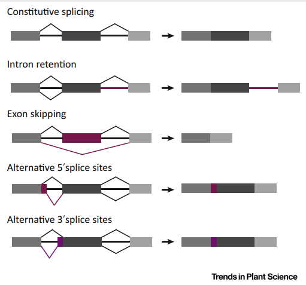
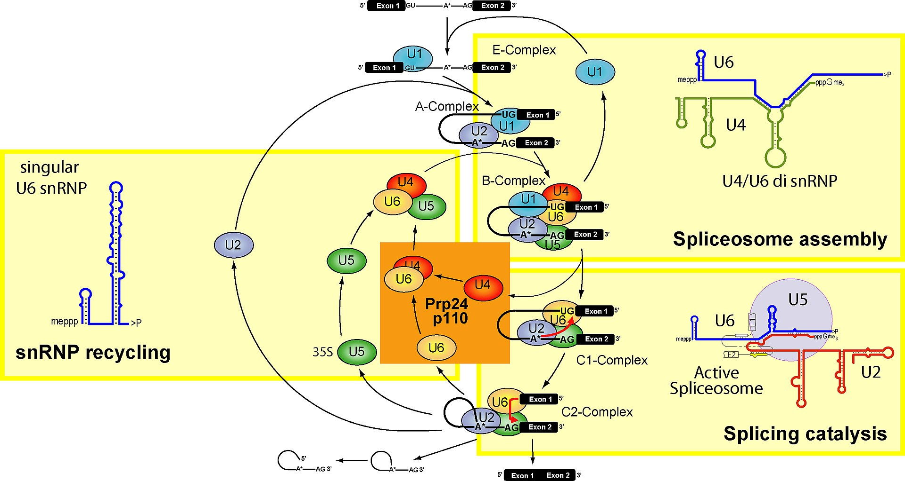
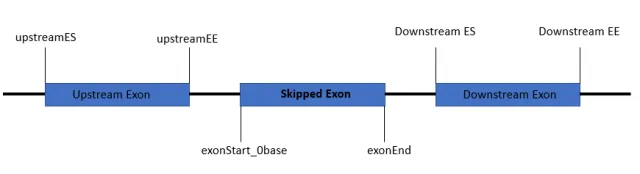

# 一、基本原理
1. **选择性剪切（alternative splicing，AS）**指发生在真核细胞的转录后修饰中，除了通过普遍的5‘加帽和3’加尾，一般还会将内含子移除，外显子重新组合，把pre-mRNA加工为可被翻译的成熟mRNA的过程，从而允许单基因产生不同的转录本，并翻译出不同的蛋白质。  

2. 目前有5种公认的选择性剪切方式：
    （1）**外显子跳跃**（Exon skipping，ES）：某些外显子被切除，另一些则被保留，然后重新组合。这是最常见的一种剪切方式。
    
    （2）**互斥外显子**（Mutually exclusive exon，ME）：两个内含子只能有一个被保留。
    
    （3）**5'端可变剪切**（Alternative 5' splice-site）：内含子的不完全剪切，保留一部分内含子的5’端序列。
    
    （4）**3'端可变剪切**（Alternative 3' splice-site）：内含子的不完全剪切，保留一部分内含子的3’端序列
    
    （5）**内含子保留**（Retained intron, RI）：内含子被保留在成熟的mRNA上。这种剪切方式在植物中被观察得比较多，但在动物中较少。内含子被保留时很有可能造成移码突变或翻译的提前终止，导致mRNA的稳定性、核输出、定位受阻，或是翻译出的蛋白质没有生物学活性。
    
    （6）**第一外显子可变剪切**（Alternative first exon, AF）
    
    （7）**末尾外显子可变剪切**（Alternative last exon, AL）

    >
    图 1 常见的内含子可变剪切方式

3. 剪切体（Splicesome）
   pre-mRNA与某些蛋白结合形成剪切蛋白复合体（Splcesome）进行选择性剪切步骤，包括移除内含子、拼接外显子。

    >内含子一般携带4种tag序列以帮助剪切蛋白识别、定位：5’末端剪切位点（5' end splice site）（GU序列），3‘末端剪切位点（3' end splice site）（AG序列），分支位点序列（branch point sequence）和多聚嘧啶束（polypyrimidine tract）。

   剪切体核心（Splicing core）主要由5种小核糖体核蛋白（Small nuclear ribonucleoprotein, snRNP）（U1, U2, U4. U5和U6）组成.它们能够精确地识别并聚集在内含子上，剪掉内含子，完成拼接过程。

   >
   图 1.1.1剪切体的剪切循环

   此外，也有其他蛋白可以调控剪切。如丝氨酸-精氨酸丰富蛋白（serine/arginine-rich protein，SR）和异源核糖蛋白（heterogeneous nuclear ribonucleoproteins，hnRNP）。这两种蛋白都能结合在pre-mRNA的剪切位点——顺式作用元件，协助完成转录后修饰过程。
   

# 二、rMATS可变剪切流程
## 2.1. 软件安装
```
mamba install bioconda::rmats
rmats.py -h
mamba install bioconda::bioconductor-pairadise
mamba install bioconda::rmats2sashimiplot
```
bam文件存储路径：/home/xiang/alternative/01.gonad_transcriptome
```
samtools view -h 文件名 |less -SN
```


## 2.2. 所需素材文件
（1）将测序数据比对完成的各个分组和每个样本的bam文件；
（2）物种的gff或gft注释文件
```
scp -P 65022 -r /disk-chenlb/03.genomic/02_Oreochromis_niloticus.Orenil/Oreochromis_niloticus.O_niloticus_UMD_NMBU.100.gtf xiang@172.18.3.144:/home/xiang/alternative/genome
```


## 2.3. 选择性剪切
rMATS仅需一行代码即可完成选择性剪切的比对：
```
rmats.py --b1 /home/xiang/alternative/01.gonad_transcriptome/rmats/b1.txt --b2 /home/xiang/alternative/01.gonad_transcriptome/rmats/b2.txt --gtf /home/xiang/alternative/genome/Oreochromis_niloticus.O_niloticus_UMD_NMBU.100.gtf -t paired --readLength 151 --variable-read-length --nthread 20 --novelSS --od /home/xiang/alternative/01.gonad_transcriptome/rmats/demo --tmp /home/xiang/alternative/tmp
#--gtf 为已知的基因及转录本的gtf文件；
#--od 即为输出路径；
#-t 测序类型为单端或者双端 ;
#--readLength 测序读长，可通过测序报告获得；
#--libType 文库类型，可选择是否为链特异性；
#--tmp 暂存目录；
#--b1 为组别1（对照组）的bam文件的路径，若有生物学重复则bam文件路径用逗号隔开；
#--b2 为组别2（实验组）的bam文件的路径，若有生物学重复则bam文件路径用逗号隔开；

ls /direction | sed "s:^:`pwd`/:"
head b1.txt 
/home/xiang/alternative/01.gonad_transcriptome/10dph/36-10D-F1_S46_R.bam,/home/xiang/alternative/01.gonad_transcriptome/10dph/36-10D-F2_S47_R.bam,/home/xiang/alternative/01.gonad_transcriptome/10dph/36-10D-F3_S48_R.bam
```
为单比较组时，仅给b1或者给s1即可；


该步骤输出数个选择性剪切的结果文件。

```
### 5dph output
nohup rmats.py --b1 /home/xiang/alternative/01.gonad_transcriptome/rmats/5dph_control.txt --b2 /home/xiang/alternative/01.gonad_transcriptome/rmats/5dph_treat.txt --gtf /home/xiang/alternative/genome/Oreochromis_niloticus.O_niloticus_UMD_NMBU.100.gtf -t paired --readLength 151 --variable-read-length --nthread 20 --novelSS --od /home/xiang/alternative/01.gonad_transcriptome/rmats/5dph_output --tmp /home/xiang/alternative/rmats/tmp

### 7dph output
nohup rmats.py --b1 /home/xiang/alternative/01.gonad_transcriptome/rmats/7dph_control.txt --b2 /home/xiang/alternative/01.gonad_transcriptome/rmats/7dph_treat.txt --gtf /home/xiang/alternative/genome/Oreochromis_niloticus.O_niloticus_UMD_NMBU.100.gtf -t paired --readLength 151 --variable-read-length --nthread 20 --novelSS --od /home/xiang/alternative/01.gonad_transcriptome/rmats/7dph_output --tmp /home/xiang/alternative/rmats/tmp >nohup_7dph.log 2>error_7dph.log&


### 10dph
nohup rmats.py --b1 /home/xiang/alternative/01.gonad_transcriptome/rmats/10dph_control.txt --b2 /home/xiang/alternative/01.gonad_transcriptome/rmats/10dph_treat.txt --gtf /home/xiang/alternative/genome/Oreochromis_niloticus.O_niloticus_UMD_NMBU.100.gtf -t paired --readLength 151 --variable-read-length --nthread 20 --novelSS --od /home/xiang/alternative/01.gonad_transcriptome/rmats/10dph_output --tmp /home/xiang/alternative/rmats/tmp >nohup_10dph.log 2>error_10dph.log&


### 15dph
nohup rmats.py --b1 /home/xiang/alternative/01.gonad_transcriptome/rmats/15dph_control.txt --b2 /home/xiang/alternative/01.gonad_transcriptome/rmats/15dph_treat.txt --gtf /home/xiang/alternative/genome/Oreochromis_niloticus.O_niloticus_UMD_NMBU.100.gtf -t paired --readLength 151 --variable-read-length --nthread 20 --novelSS --od /home/xiang/alternative/01.gonad_transcriptome/rmats/15dph_output --tmp /home/xiang/alternative/rmats/tmp >nohup_15dph.log 2>error_15dph.log&

```


# 三. 结果解读
## 3.1 文件前缀代表可变剪切的方式：
（1）**A3SS, A5SS**：mRNA的5'端或3'端的选择性剪切

（2）**SE**：外显子跳跃

（3）**MXE**：互斥外显子

（4）**RI**：内含子保留

（5）**[AS_Event].MATS.JC.txt**：连接计数（Junction Counts，JC）指某些外显子被切除或仅保留一部分，产生跨越剪切位点的片段（Junction），有别于被完整保留的外显子；

（6）**[AS_Event].MATS.JCEC.txt**：包括跨越剪切位点的片段（Junction）和不跨越剪切位点的完整外显子（Exon），考虑已知可变剪切事件时，可重点参考这个文件；

（7）**fromGTF.[AS_Event].txt**：从RNA和GTF中检出的所有可变剪切事件；

（8）**fromGTF.novelJunction.[AS_Event].txt**：仅使用RNA鉴定的可变剪切事件，与gtf的分析分离，其中并不包含未注释的可变剪切位点；

（9）**fromGTF.novelSpliceSite.[AS_Event].txt**：文件中仅包含未知的可变剪切位点的可变剪切事件，仅使用--novelSS参数时产生该文件；

（10）**JC.raw.input.[AS_Event].txt**：文件的input raw文件；

（11）**JCEC.raw.input.[AS_Event].txt**：[AS_Event].MATS.JCEC.txt文件的input raw文件。

>其中JC和JCEC的区别在于前者考虑跨越剪切位点的reads，而后者不仅考虑前者的reads还考虑到只比对到第一张图中条纹的区域（也就是说没有跨越剪切位点的reads），但是我们一般使用JC的结果就够了

### 3.2 文件中各列的含义
**ID**：rMATS 事件的ID；

**GeneID**：Gene ID；

**geneSymbol**：Gene 名称；

**chr**：染色体；

**strand**：基因的正负链情况；

**riExonStart**:RI事件的起始位置(被滞留的外显子的起始前一碱基位置)；

**riExonEnd**：RI事件的结束位置(被滞留的外显子的结束后一碱基位置)；

**shortES**：A5SS和A3SS中特有，指AS事件后，被裁剪的短外显子的起始位置；

**shortEE**：A5SS和A3SS中特有，指AS事件后，被裁剪的短外显子的结束位置；

**flankingES**：A5SS和A3SS中特有，指AS事件后，与短外显子的剪切端相连的前一外显子的起始位置；

**flankingEE**：A5SS和A3SS中特有，指AS事件后，与短外显子的剪切端相连的前一外显子的结束位置；

**upstreamES/EE**：发生ES事件上游exon的起始/终止位置；

**downstreamES/EE**：发生ES事件下游exon的起始/终止位置；

**1st/2ndExonstart/end**：MXE事件中，互斥的第一个/第二个外显子的起始/终止位置；

**IJC_SAMPLE_1**：sample 1中包含剪切区域的reads数，生物学重复以逗号分隔；

**SJC_SAMPLE_1**：sample 1中不包含剪切区域(skipping junction counts)的reads数，生物学重复以逗号分隔；

**IJC_SAMPLE_2**：sample 2中包含剪切区域的reads数，生物学重复以逗号分隔；

**SJC_SAMPLE_2**：sample 2中不包含剪切区域的reads数(skipping junction counts)，生物学重复以逗号分隔；

**IncFormLen**：包含区域的长度，用于校正；

**SkipFormLen**：跳过区域的长度，用于校正；

**PValue**：两个比较组可变剪切差异的显著性（仅在使用statistical model时存在）；

**FDR**：由 p-value计算的错误发现率（仅在使用statistical model时存在）；

**IncLevel1**：由校正后reads数得到的sample 1的区域等级，生物学重复以逗号分隔；

**IncLevel2**：由校正后reads数得到的sample 2的区域等级，生物学重复以逗号分隔；

**IncLevelDifference**：average(IncLevel1) - average(IncLevel2)。

>这几类文件中比较重要的要数S_Event.MATS.JC.txt，因为其他文件的信息差不多最终都整合在这个文件里面，以SE.MATS.JC.txt为例：1-5列看列名就能懂其意思的，分别ID，GeneID，geneSymbol，chr，strand。6-11列分别为外显子的位置信息，分别为exonStart_0base，exonEnd，upstreamES，upstreamEE，downstreamES，downstreamEE；网上有张图能很好的解释其含义，如下所示：

其他可变剪切文件的这几列有点略微不同，但都可以类似的理解

# 四.可视化
## 4.1 rmats2sashimiplot可视化选择性剪切
```
rmats2sashimiplot --b1 /home/xiang/alternative/01.gonad_transcriptome/rmats/5dph_control.txt --b2 /home/xiang/alternative/01.gonad_transcriptome/rmats/5dph_treat.txt --event-type RI -e /home/xiang/alternative/01.gonad_transcriptome/rmats/sashimiplot/RI.MATS.JC.TOP20.txt --l1 control --l2 case --exon_s 1 --intron_s 6 -o RI_plot.test
```
>b1和b2参数指定样本对应的bam文件，该文件必须是排序之后的，而且建立了bai的索引，l1和l2参数指定样本的名字，exon_s和intron_s参数指定图片中exon和intron的比例，min-counts用于指定展示的最小count数，如果实际的counts数小于该阈值，则不会在图中显示，-t参数指定可变剪切的类型，-e参数指定rmats产生的可变剪切结果文件。

# 五、实例：罗非鱼高温实验可变剪切分析全流程
数据存放路径：/data/ogd/zhouyan/罗非鱼耐高温转录组数据-周艳

传输文件：
```
scp -P 65022 -r /data/ogd/zhouyan/罗非鱼耐高温转录组数据-周艳 xiang@172.18.3.144:/home/xiang/alternative/tilapia_heat_trial_zhouyan

```

## 5.1 质控报告
利用fastQC软件对获得的fastq序列文件进行质量分析，生成html格式的结果报告
```
fastqc *.fq
```
脚本：
```
```
ls *-gill|grep '.R1.fq.gz'
ls *-gill|grep '.R2.fq.gz'

#!bin/sh
function0()
{
fastqc $1/$2
}

path=(28-1-1-gill 28-2-1-gill 28-3-5-gill 28-4-6-gill 28-6-5-gill 28-7-5-gill 32-1-1-gill 32-2-3-gill 32-3-6-gill 32-5-6-gill 32-6-2-gill 32-7-3-gill 36-1-6-gill 36-2-6-gill 36-3-6-gill 36-5-2-gill 36-6-6-gill 36-7-3-gill 28-1-1-gill 28-2-1-gill 28-3-5-gill 28-4-6-gill 28-6-5-gill 28-7-5-gill 32-1-1-gill 32-2-3-gill 32-3-6-gill 32-5-6-gill 32-6-2-gill 32-7-3-gill 36-1-6-gill 36-2-6-gill 36-3-6-gill 36-5-2-gill 36-6-6-gill 36-7-3-gill)

filename=(28-1-1-gill_R1.fq.gz 28-2-1-gill_R1.fq.gz 28-3-5-gill_R1.fq.gz 28-4-6-gill_R1.fq.gz 28-6-5-gill_R1.fq.gz 28-7-5-gill_R1.fq.gz 32-1-1-gill_R1.fq.gz 32-2-3-gill_R1.fq.gz 32-3-6-gill_R1.fq.gz 32-5-6-gill_R1.fq.gz 32-6-2-gill_R1.fq.gz 32-7-3-gill_R1.fq.gz 36-1-6-gill_R1.fq.gz 36-2-6-gill_R1.fq.gz 36-3-6-gill_R1.fq.gz 36-5-2-gill_R1.fq.gz 36-6-6-gill_R1.fq.gz 36-7-3-gill_R1.fq.gz 28-1-1-gill_R2.fq.gz 28-2-1-gill_R2.fq.gz 28-3-5-gill_R2.fq.gz 28-4-6-gill_R2.fq.gz 28-6-5-gill_R2.fq.gz 28-7-5-gill_R2.fq.gz 32-1-1-gill_R2.fq.gz 32-2-3-gill_R2.fq.gz 32-3-6-gill_R2.fq.gz 32-5-6-gill_R2.fq.gz 32-6-2-gill_R2.fq.gz 32-7-3-gill_R2.fq.gz 36-1-6-gill_R2.fq.gz 36-2-6-gill_R2.fq.gz 36-3-6-gill_R2.fq.gz 36-5-2-gill_R2.fq.gz 36-6-6-gill_R2.fq.gz 36-7-3-gill_R2.fq.gz)


for ((i=0;i<36;i++))
do
    function0 ${path[i]} ${filename[i]}
done
exit

nohup bash data_filter.sh>nohup.log 2>error.log&
```

```

## 5.2 数据过滤
利用Trimmomatic软件除去序列文件中的接头（adapter），并对碱基进行合适的修改，然后对碱基进行修剪，对低质量的序列进行过滤
```
trimmomatic PE  -threads 20 -phred33 36-3-6-gill_R1.fq.gz 36-3-6-gill_R2.fq.gz -summary /home/xiang/alternative/tilapia_heat_trial_zhouyan/01_trimmomaticFiltering/36-3-6-gill.summary -baseout /home/xiang/alternative/tilapia_heat_trial_zhouyan/01_trimmomaticFiltering/36-3-6-gill LEADING:3 TRAILING:3 SLIDINGWINDOW:4:15 HEADCROP:13 MINLEN:36 ILLUMINACLIP:/home/xiang/alternative/tilapia_heat_trial_zhouyan/adapters/TruSeq3-PE.fa:2:30:10

参数说明：
PE/SE 设定对Paired-End或Single-End的reads进行处理，其输入和输出参数稍有不一样。
-threads 设置多线程运行数
-phred33 设置碱基的质量格式，默认是phred64; Sanger/Illumina 1.9+ encoding为33; Illumina 1.5 encoding为64
ILLUMINACLIP:TruSeq3-PE.fa:2:30:10 TruSeq3-PE.fa是接头序列，2是比对时接头序列时所允许的最大错配数；30指的是要求PE的两条read同时和PE的adapter序列比对，匹配度加起来超30%，那么就认为这对PE的read含有adapter，并在对应的位置需要进行切除。10和前面的30不同，它指的是，我就什么也不管，反正只要这条read的某部分和adpater序列有超过10%的匹配率，那么就代表含有adapter了，需要进行去除数：palindrome模式下匹配碱基数阈值：simple模式下的匹配碱基数阈值。
LEADING:3 切除首端碱基质量小于3的碱基
TRAILING:3 切除尾端碱基质量小于3的碱基
SLIDINGWINDOW:4:15 从5'端开始进行滑动，当滑动位点周围一段序列(window)的平均碱基低于阈值，则从该处进行切除。Windows的size是4个碱基，其平均碱基质量小于15，则切除。
MINLEN:50 规定read被切除后至少需要保留的长度，如果低于该长度，会被丢掉
CROP:<length> 保留reads到指定的长度
HEADCROP:<length> 在reads的首端切除指定的长度
TOPHRED33 将碱基质量转换为pred33格式
TOPHRED64 将碱基质量转换为pred64格式
```

输出以下文件：
```
28-1-1-gill_1P  28-1-1-gill_1U  28-1-1-gill_2P  28-1-1-gill_2U  28-1-1-gill.summary
```
p结尾的是去除接头并过滤后的序列文件；U结尾的是低质量垃圾序列

写个脚本循环处理：
```
ls *-gill|grep '.R1.fq.gz'
ls *-gill|grep '.R2.fq.gz'

#!bin/sh
filter(){
trimmomatic PE  -threads 20 -phred33 $1/$2 $1/$3 -summary ../01_trimmomaticFiltering/$1.summary -baseout ../01_trimmomaticFiltering/$1 LEADING:3 TRAILING:3 SLIDINGWINDOW:4:15 HEADCROP:13 MINLEN:36 ILLUMINACLIP:/home/xiang/alternative/tilapia_heat_trial_zhouyan/adapters/TruSeq3-PE.fa:2:30:10
}
path=(28-3-5-gill 28-4-6-gill 28-6-5-gill 28-7-5-gill 32-1-1-gill 32-2-3-gill 32-3-6-gill 32-5-6-gill 32-6-2-gill 32-7-3-gill 36-1-6-gill 36-2-6-gill 36-3-6-gill 36-5-2-gill 36-6-6-gill 36-7-3-gill)
r1=(28-3-5-gill_R1.fq.gz 28-4-6-gill_R1.fq.gz 28-6-5-gill_R1.fq.gz 28-7-5-gill_R1.fq.gz 32-1-1-gill_R1.fq.gz 32-2-3-gill_R1.fq.gz 32-3-6-gill_R1.fq.gz 32-5-6-gill_R1.fq.gz 32-6-2-gill_R1.fq.gz 32-7-3-gill_R1.fq.gz 36-1-6-gill_R1.fq.gz 36-2-6-gill_R1.fq.gz 36-3-6-gill_R1.fq.gz 36-5-2-gill_R1.fq.gz 36-6-6-gill_R1.fq.gz 36-7-3-gill_R1.fq.gz)
r2=(28-3-5-gill_R2.fq.gz 28-4-6-gill_R2.fq.gz 28-6-5-gill_R2.fq.gz 28-7-5-gill_R2.fq.gz 32-1-1-gill_R2.fq.gz 32-2-3-gill_R2.fq.gz 32-3-6-gill_R2.fq.gz 32-5-6-gill_R2.fq.gz 32-6-2-gill_R2.fq.gz 32-7-3-gill_R2.fq.gz 36-1-6-gill_R2.fq.gz 36-2-6-gill_R2.fq.gz 36-3-6-gill_R2.fq.gz 36-5-2-gill_R2.fq.gz 36-6-6-gill_R2.fq.gz 36-7-3-gill_R2.fq.gz)
for ((i=0;i<16;i++))
do
    filter ${path[i]} ${r1[i]} ${r2[i]}
done
exit

nohup bash data_filter.sh>nohup.log 2>error.log&
```
## 5.3 比对
下载参考基因组，并建立索引，然后使用hisat2把过滤后的转录本序列比对到参考基因组上。
```
#构建索引
gunzip -c GCF_001858045.1_ASM185804v2_genomic.fna.gz > GCF_001858045.1_ASM185804v2_genomic.fna
hisat2-build -p 1 GCF_001858045.2_O_niloticus_UMD_NMBU_genomic.fna ./index/GCF_001858045.2_ASM185804v2_genomic

#比对
hisat2 -p 20 -x /home/xiang/alternative/tilapia_heat_trial_zhouyan/database/index/GCF_001858045.2_ASM185804v2_genomic -1 ./01_trimmomaticFiltering/36-3-6-gill_1P -2 ./01_trimmomaticFiltering/36-3-6-gill_2P -S 02_hisat2Mapping/36-3-6-gill.remake.sam --new-summary 1>02_hisat2Mapping/36-3-6-gill_hisat2Mapping.remake.log 2>&1


-p 线程数
-x 参考基因组路径
-1&-2 上一步过滤得到的双端测序数据
-S 输出路径
--new-summary 报告文件路径
```
得到的日志文件中包含比对成功的reads数量和比对率等信息：
```
Warning: Unsupported file format
HISAT2 summary stats:
        Total pairs: 20270289
                Aligned concordantly or discordantly 0 time: 2857617 (14.10%)
                Aligned concordantly 1 time: 15848966 (78.19%)
                Aligned concordantly >1 times: 1150353 (5.68%)
                Aligned discordantly 1 time: 413353 (2.04%)
        Total unpaired reads: 5715234
                Aligned 0 time: 3526928 (61.71%)
                Aligned 1 time: 1870992 (32.74%)
                Aligned >1 times: 317314 (5.55%)
        Overall alignment rate: 91.30%

```

批处理脚本：
```
#!bin/sh
hisat(){
hisat2 -p 20 -x /home/xiang/alternative/tilapia_heat_trial_zhouyan/database/index/GCF_001858045.2_ASM185804v2_genomic -1 ./01_trimmomaticFiltering/$1 -2 ./01_trimmomaticFiltering/$2 -S 02_hisat2Mapping/$3.sam --new-summary 1>02_hisat2Mapping/$3_hisat2Mapping.log 2>&1
}

p1=(28-1-1-gill_1P 28-3-5-gill_1P 28-6-5-gill_1P 32-1-1-gill_1P 32-3-6-gill_1P 32-6-2-gill_1P 36-1-6-gill_1P 36-3-6-gill_1P 36-6-6-gill_1P 28-2-1-gill_1P 28-4-6-gill_1P 28-7-5-gill_1P 32-2-3-gill_1P 32-5-6-gill_1P 32-7-3-gill_1P 36-2-6-gill_1P 36-5-2-gill_1P  36-7-3-gill_1P)

p2=(28-1-1-gill_2P 28-3-5-gill_2P 28-6-5-gill_2P 32-1-1-gill_2P 32-3-6-gill_2P 32-6-2-gill_2P 36-1-6-gill_2P 36-3-6-gill_2P 36-6-6-gill_2P
28-2-1-gill_2P 28-4-6-gill_2P 28-7-5-gill_2P 32-2-3-gill_2P 32-5-6-gill_2P 32-7-3-gill_2P 36-2-6-gill_2P 36-5-2-gill_2P  36-7-3-gill_2P)

name=(28-1-1-gill 28-3-5-gill 28-6-5-gill 32-1-1-gill 32-3-6-gill 32-6-2-gill 36-1-6-gill 36-3-6-gill 36-6-6-gill
28-2-1-gill 28-4-6-gill 28-7-5-gill 32-2-3-gill 32-5-6-gill 32-7-3-gill 36-2-6-gill 36-5-2-gill  36-7-3-gill)

for ((i=0;i<18;i++))
do
    hisat ${p1[i]} ${p2[i]} ${name[i]}
done


nohup bash hisat2_compare.sh>nouhup.log 2>error.log&
```
压缩sam文件，节省空间：
```
#!bin/sh
sam(){
samtools view -bS 02_hisat2Mapping/$1.sam > 02_hisat2Mapping/$1.bam
}

file=(28-1-1-gill  28-3-5-gill  28-6-5-gill  32-1-1-gill  32-3-6-gill  32-6-2-gill  36-1-6-gill  36-3-6-gill  36-6-6-gill 28-2-1-gill  28-4-6-gill  28-7-5-gill  32-2-3-gill  32-5-6-gill  32-7-3-gill  36-2-6-gill  36-5-2-gill  36-7-3-gill)

for ((i=0;i<18;i++))
do
    sam ${file[i]}
done
```

## 5.4 选择性剪切分析
### 5.4.1 缺氧组可变剪切挖掘
先把罗非鱼的gff文件转换成gtf文件，这样可以统计每种基因有几种剪切体：
```
gffread -T GCF_001858045.1_ASM185804v2_genomic.gff  -o GCF_001858045.1_ASM185804v2_genomic.gtf
```
rmats查找可变剪切（一定要联网，不联网会报错不输出结果……）
```
nohup rmats.py --b1 /home/xiang/alternative/tilapia_heat_trial_zhouyan/03_rmatsAlatersplicing/tp_28_control.txt --b2 /home/xiang/alternative/tilapia_heat_trial_zhouyan/03_rmatsAlatersplicing/tp_28_hypo.txt --gtf /home/xiang/alternative/tilapia_heat_trial_zhouyan/database/GCF_001858045.2_O_niloticus_UMD_NMBU_genomic.gtf -t paired --readLength 150 --variable-read-length --nthread 20 --novelSS --od /home/xiang/alternative/tilapia_heat_trial_zhouyan/03_rmatsAlatersplicing/28_results/ --tmp /home/xiang/alternative/tilapia_heat_trial_zhouyan/03_rmatsAlatersplicing/tmp >nohup_28.log 2>error_28&

nohup rmats.py --b1 /home/xiang/alternative/tilapia_heat_trial_zhouyan/03_rmatsAlatersplicing/tp_32_control.txt --b2 /home/xiang/alternative/tilapia_heat_trial_zhouyan/03_rmatsAlatersplicing/tp_32_hypo.txt --gtf /home/xiang/alternative/tilapia_heat_trial_zhouyan/database/GCF_001858045.2_O_niloticus_UMD_NMBU_genomic.gtf -t paired --readLength 150 --variable-read-length --nthread 20 --novelSS --od /home/xiang/alternative/tilapia_heat_trial_zhouyan/03_rmatsAlatersplicing/32_results --tmp /home/xiang/alternative/tilapia_heat_trial_zhouyan/03_rmatsAlatersplicing/tmp >nohup_32.log 2>error_32.log&

nohup rmats.py --b1 /home/xiang/alternative/tilapia_heat_trial_zhouyan/03_rmatsAlatersplicing/tp_36_control.txt --b2 /home/xiang/alternative/tilapia_heat_trial_zhouyan/03_rmatsAlatersplicing/tp_36_hypo.txt --gtf /home/xiang/alternative/tilapia_heat_trial_zhouyan/database/GCF_001858045.2_O_niloticus_UMD_NMBU_genomic.gtf -t paired --readLength 150 --variable-read-length --nthread 20 --novelSS --od /home/xiang/alternative/tilapia_heat_trial_zhouyan/03_rmatsAlatersplicing/36_results --tmp /home/xiang/alternative/tilapia_heat_trial_zhouyan/03_rmatsAlatersplicing/tmp >nohup_36.log 2>error_36.log&

```

### 5.4.2 高温组可变剪切挖掘
流程与上一步相同，换下样本就行：
```
# 温度
nohup rmats.py --b1 /home/xiang/alternative/tilapia_heat_trial_zhouyan/03_rmatsAlatersplicing/tp_28_control.txt --b2 /home/xiang/alternative/tilapia_heat_trial_zhouyan/03_rmatsAlatersplicing/tp_32_control.txt --gtf /home/xiang/alternative/tilapia_heat_trial_zhouyan/database/GCF_001858045.2_O_niloticus_UMD_NMBU_genomic.gtf -t paired --readLength 150 --variable-read-length --nthread 10 --novelSS --od /home/xiang/alternative/tilapia_heat_trial_zhouyan/03_rmatsAlatersplicing//temperature/28VS32_results/ --tmp /home/xiang/alternative/tilapia_heat_trial_zhouyan/03_rmatsAlatersplicing/tmp >nohup_28VS32.log 2>error_28VS32.log&

nohup rmats.py --b1 /home/xiang/alternative/tilapia_heat_trial_zhouyan/03_rmatsAlatersplicing/tp_28_control.txt --b2 /home/xiang/alternative/tilapia_heat_trial_zhouyan/03_rmatsAlatersplicing/tp_36_control.txt --gtf /home/xiang/alternative/tilapia_heat_trial_zhouyan/database/GCF_001858045.2_O_niloticus_UMD_NMBU_genomic.gtf -t paired --readLength 150 --variable-read-length --nthread 20 --novelSS --od /home/xiang/alternative/tilapia_heat_trial_zhouyan/03_rmatsAlatersplicing//temperature/28VS36_results/ --tmp /home/xiang/alternative/tilapia_heat_trial_zhouyan/03_rmatsAlatersplicing/tmp >nohup_28VS36.log 2>error_28VS36.log&

nohup rmats.py --b1 /home/xiang/alternative/tilapia_heat_trial_zhouyan/03_rmatsAlatersplicing/tp_32_control.txt --b2 /home/xiang/alternative/tilapia_heat_trial_zhouyan/03_rmatsAlatersplicing/tp_36_control.txt --gtf /home/xiang/alternative/tilapia_heat_trial_zhouyan/database/GCF_001858045.2_O_niloticus_UMD_NMBU_genomic.gtf -t paired --readLength 150 --variable-read-length --nthread 10 --novelSS --od /home/xiang/alternative/tilapia_heat_trial_zhouyan/03_rmatsAlatersplicing//temperature/32VS36_results/ --tmp /home/xiang/alternative/tilapia_heat_trial_zhouyan/03_rmatsAlatersplicing/tmp >nohup_32VS36.log 2>error_32VS36.log&


#### 去除36度对照组的第三个样本(36-3-6这个样品是二次上机的，存在批次效应且匹配率低质量较差，可变剪切如何归一化样品？直接删去样品最快捷)
nohup rmats.py --b1 /home/xiang/alternative/tilapia_heat_trial_zhouyan/03_rmatsAlatersplicing/tp_32_control.txt --b2 /home/xiang/alternative/tilapia_heat_trial_zhouyan/03_rmatsAlatersplicing/tp_36_control_ex.txt --gtf /home/xiang/alternative/tilapia_heat_trial_zhouyan/database/GCF_001858045.2_O_niloticus_UMD_NMBU_genomic.gtf -t paired --readLength 150 --variable-read-length --nthread 10 --novelSS --od /home/xiang/alternative/tilapia_heat_trial_zhouyan/03_rmatsAlatersplicing//temperature/32VS36_results_ex/ --tmp /home/xiang/alternative/tilapia_heat_trial_zhouyan/03_rmatsAlatersplicing/tmp >nohup_32VS36.log 2>error_32VS36.log&

nohup rmats.py --b1 /home/xiang/alternative/tilapia_heat_trial_zhouyan/03_rmatsAlatersplicing/tp_28_control.txt --b2 /home/xiang/alternative/tilapia_heat_trial_zhouyan/03_rmatsAlatersplicing/tp_36_control_ex.txt --gtf /home/xiang/alternative/tilapia_heat_trial_zhouyan/database/GCF_001858045.2_O_niloticus_UMD_NMBU_genomic.gtf -t paired --readLength 150 --variable-read-length --nthread 10 --novelSS --od /home/xiang/alternative/tilapia_heat_trial_zhouyan/03_rmatsAlatersplicing//temperature/28VS36_results/ --tmp /home/xiang/alternative/tilapia_heat_trial_zhouyan/03_rmatsAlatersplicing/tmp >nohup_28VS36.log 2>error_28VS36.log&

nohup rmats.py --b1 /home/xiang/alternative/tilapia_heat_trial_zhouyan/03_rmatsAlatersplicing/tp_36_control_ex.txt --b2 /home/xiang/alternative/tilapia_heat_trial_zhouyan/03_rmatsAlatersplicing/tp_36_hypo.txt --gtf /home/xiang/alternative/tilapia_heat_trial_zhouyan/database/GCF_001858045.2_O_niloticus_UMD_NMBU_genomic.gtf -t paired --readLength 150 --variable-read-length --nthread 10 --novelSS --od /home/xiang/alternative/tilapia_heat_trial_zhouyan/03_rmatsAlatersplicing/hypoxia/36_results/ --tmp /home/xiang/alternative/tilapia_heat_trial_zhouyan/03_rmatsAlatersplicing/tmp >nohup_36.log 2>error_36.log&

### 加上36-3-6的
nohup rmats.py --b1 /home/xiang/alternative/tilapia_heat_trial_zhouyan/03_rmatsAlatersplicing/tp_36_control_ex.txt --b2 /home/xiang/alternative/tilapia_heat_trial_zhouyan/03_rmatsAlatersplicing/tp_36_hypo_ex.txt --gtf /home/xiang/alternative/tilapia_heat_trial_zhouyan/database/GCF_001858045.2_O_niloticus_UMD_NMBU_genomic.gtf -t paired --readLength 150 --variable-read-length --nthread 20 --novelSS --od /home/xiang/alternative/tilapia_heat_trial_zhouyan/03_rmatsAlatersplicing/hypoxia/36_results/demo/ --tmp /home/xiang/alternative/tilapia_heat_trial_zhouyan/03_rmatsAlatersplicing/tmp/ >nohup_36.log 2>error_36.log&
```


#### 2024.10.30更新
```
# Temp_28vs36
#  samtools检查序列是否匹配
samtools stats 36-3-6-gill.sort.bam | grep 'pair'
```
```
ls *.sort.bam|cut -c 1-6|tr '\n' ' '

#!bin/sh
function_samtools(){
    samtools stat $1-gill.sort.bam | grep 'pair'>$1-gill.log
}
filename=(28-1-1 28-2-1 28-3-5 28-4-6 28-6-5 28-7-5 32-1-1 32-2-3 32-3-6 32-5-6 32-6-2 32-7-3 36-1-6 36-2-6 36-3-6 36-5-2 36-6-6 36-7-3)

for ((i=0;i<18;i++))
do
    function_samtools $filename[i]
done
exit
```

```
# bowtie2比对
## 索引
bowtie2-build -f GCF_001858045.2_O_niloticus_UMD_NMBU_genomic.fna ./bowtie2_index/GCF_001858045.2_O_niloticus_UMD_NMBU_genomic

## 比对
bowtie2 -x /home/xiang/alternative/tilapia_heat_trial_zhouyan/database/bowtie2_index/GCF_001858045.2_O_niloticus_UMD_NMBU_genomic -1 36-3-6-gill_R1.fq.gz -2 36-3-6-gill_R2.fq.gz -S /home/xiang/alternative/tilapia_heat_trial_zhouyan/02_hisat2Mapping/36-3-6.remake.sam

nohup rmats.py --b1 28_sample_ct.txt --b2 36_sample_ct.txt --gtf /home/xiang/alternative/tilapia_heat_trial_zhouyan/database/GCF_001858045.2_O_niloticus_UMD_NMBU_genomic.gtf -t paired  --variable-read-length --nthread 30 --novelSS --od ./ASresults --tmp ./tmp/ >nohup.log&

--statoff 命令行参数跳过统计模型（不统计可变剪切，输出原始reads统计情况）
--allow-clipping 命令rmats使用clipped reads（用于clipped reads被异常过滤的情况）
```


## 5.5 rmats2sashimiplot可视化选择性剪切
使用rmats2sashimiplot可视化：
```
### 需要先用samtools对前面的bam文件构建索引，得到bai文件，才能可视化！！！

function_sort(){
    samtools sort -l 4 -o ./$1.sort.bam $1.bam
}

function_index(){
    samtools index -b $1.sort.bam
}

filename=(28-1-1-gill 28-2-1-gill 28-3-5-gill 28-4-6-gill 28-6-5-gill 28-7-5-gill 32-1-1-gill 32-2-3-gill 32-3-6-gill 32-5-6-gill 32-6-2-gill 32-7-3-gill 36-1-6-gill 36-2-6-gill 36-3-6-gill 36-5-2-gill 36-6-6-gill 36-7-3-gill)

for ((i=0;i<18;i++))
do
    function_sort ${filename[i]}
done


for ((i=0;i<18;i++))
do
    function_index ${filename[i]}
done
exit

nohup bash index.sh >nohup.log&
```

```
# 可视化
rmats2sashimiplot --b1 28_sample_ct.txt --b2 36_sample_ct.txt --color '#3498db,#3498db,#3498db,#e67e22,#e67e22,#e67e22' --event-type RI -e /home/xiang/alternative/tilapia_heat_trial_zhouyan/04_rmatsashimiplot/28VS36_cute_se_genes.txt --l1 Temperature_28°C --l2 Temperature_36°C --exon_s 1 --intron_s 6 -o Kdm6bb_28vs36_RI_plot.

# b1和b2参数指定样本对应的bam文件，该文件必须是排序之后的，而且建立了bai的索引，
# l1和l2参数指定b1和b2的组别，如control和treatment
# exon_s和intron_s参数指定图片中exon和intron的比例，
# min-counts用于指定展示的最小count数，如果实际的counts数小于该阈值，则不会在图中显示，
#-t参数指定可变剪切的类型，
# -e参数选择哪些基因的剪切事件做可视化


## 先选几个感兴趣的基因做可视化
rmats2sashimiplot --b1 28_sample_ct.txt --b2 36_sample_ct.txt --color '#3498db,#3498db,#3498db,#e67e22,#e67e22,#e67e22' --event-type RI -e 28VS36_Capn1.txt --l1 Temperature_28 --l2 Temperature_36 --exon_s 1 --intron_s 6 -o Capn_28vs36_RI_plot

## kdm6bb基因可视化
ls /home/xiang/alternative/tilapia_heat_trial_zhouyan/02_hisat2Mapping/28*.bam|grep .gill.sort.bam|tr '\n' ','
$ cat normal_temp.txt 
/home/xiang/alternative/tilapia_heat_trial_zhouyan/02_hisat2Mapping/28-1-1-gill.sort.bam,/home/xiang/alternative/tilapia_heat_trial_zhouyan/02_hisat2Mapping/28-2-1-gill.sort.bam,/home/xiang/alternative/tilapia_heat_trial_zhouyan/02_hisat2Mapping/28-3-5-gill.sort.bam,/home/xiang/alternative/tilapia_heat_trial_zhouyan/02_hisat2Mapping/28-4-6-gill.sort.bam,/home/xiang/alternative/tilapia_heat_trial_zhouyan/02_hisat2Mapping/28-6-5-gill.sort.bam,/home/xiang/alternative/tilapia_heat_trial_zhouyan/02_hisat2Mapping/28-7-5-gill.sort.bam

$ cat high_temp.txt
/home/xiang/alternative/tilapia_heat_trial_zhouyan/02_hisat2Mapping/32-1-1-gill.sort.bam,/home/xiang/alternative/tilapia_heat_trial_zhouyan/02_hisat2Mapping/32-2-3-gill.sort.bam,/home/xiang/alternative/tilapia_heat_trial_zhouyan/02_hisat2Mapping/32-3-6-gill.sort.bam,/home/xiang/alternative/tilapia_heat_trial_zhouyan/02_hisat2Mapping/32-5-6-gill.sort.bam,/home/xiang/alternative/tilapia_heat_trial_zhouyan/02_hisat2Mapping/32-6-2-gill.sort.bam,/home/xiang/alternative/tilapia_heat_trial_zhouyan/02_hisat2Mapping/32-7-3-gill.sort.bam,/home/xiang/alternative/tilapia_heat_trial_zhouyan/02_hisat2Mapping/36-1-6-gill.sort.bam,/home/xiang/alternative/tilapia_heat_trial_zhouyan/02_hisat2Mapping/36-2-6-gill.sort.bam,/home/xiang/alternative/tilapia_heat_trial_zhouyan/02_hisat2Mapping/36-3-6-gill.sort.bam,/home/xiang/alternative/tilapia_heat_trial_zhouyan/02_hisat2Mapping/36-5-2-gill.sort.bam,/home/xiang/alternative/tilapia_heat_trial_zhouyan/02_hisat2Mapping/36-6-6-gill.sort.bam,/home/xiang/alternative/tilapia_heat_trial_zhouyan/02_hisat2Mapping/36-7-3-gill.sort.bam

rmats2sashimiplot --b1 normal_temp.txt --b2 high_temp_ex.txt --event-type RI -e Kdm6bb_as.txt --l1 Temperature_28 --l2 Temperature_32_36 --exon_s 1 --intron_s 6 -o Kdm6bb_all_sample

```

## 5.6 差异基因分析
后续可以另外做基因表达量分析，然后对可变剪切和差异基因做KEGG和GO富集，分析哪些通路和基因影响表型。


# 六.表达量分析

## 6.1 featurecounts计算reads数
前提：需要hisat2等软件处理比对后的bam文件
```
featureCounts -T 16 -p -t exon -g gene_id -a /home/xiang/alternative/tilapia_heat_trial_zhouyan/database/GCF_001858045.2_O_niloticus_UMD_NMBU_genomic.gtf -o /home/xiang/alternative/tilapia_heat_trial_zhouyan/05_featurecounts/all_feature.txt 28-1-1-gill.bam  28-3-5-gill.bam  28-6-5-gill.bam  32-1-1-gill.bam  32-3-6-gill.bam  32-6-2-gill.bam  36-1-6-gill.bam  36-3-6-gill.bam  36-6-6-gill.bam 28-2-1-gill.bam  28-4-6-gill.bam  28-7-5-gill.bam  32-2-3-gill.bam  32-5-6-gill.bam  32-7-3-gill.bam  36-2-6-gill.bam  36-5-2-gill.bam  36-7-3-gill.bam

# -T 使用的线程数
# -p 如果是paird end 就用
# -t 将exon作为一个feature
# -g 将gene_id作为一个feature
# -a 参考的gtf/gff
# -o 输出文件
```

## 6.2 DESeq2差异分析
使用R包DESeq2对上步得到的reads进行表达量差异分析
```
## 实例代码

library(DESeq2)

## 数据预处理
sampleNames <- c("10A_1", "10A_2", "10A_3", "7_1", "7_2", "7_3")
# 第一行是命令信息，所以跳过
data <- read.table("all_feature.txt", header=TRUE, quote="\t", skip=1)
# 前六列分别是Geneid	Chr	Start	End	Strand	Length
# 我们要的是count数，所以从第七列开始
names(data)[7:12] <- sampleNames
countData <- as.matrix(data[7:12])
rownames(countData) <- data$Geneid
database <- data.frame(name=sampleNames, condition=c("10A", "10A", "10A", "7", "7", "7"))
rownames(database) <- sampleNames

## 设置分组信息并构建dds对象
dds <- DESeqDataSetFromMatrix(countData, colData=database, design= ~ condition)
dds <- dds[ rowSums(counts(dds)) > 1, ]

## 使用DESeq函数估计离散度，然后差异分析获得res对象
dds <- DESeq(dds)
res <- results(dds)
write.csv(res, "res_des_output.csv")
resdata <- merge(as.data.frame(res), as.data.frame(counts(dds, normalized=TRUE)),by="row.names",sort=FALSE)
write.csv(resdata, "all_des_output.csv", row.names=FALSE)
```